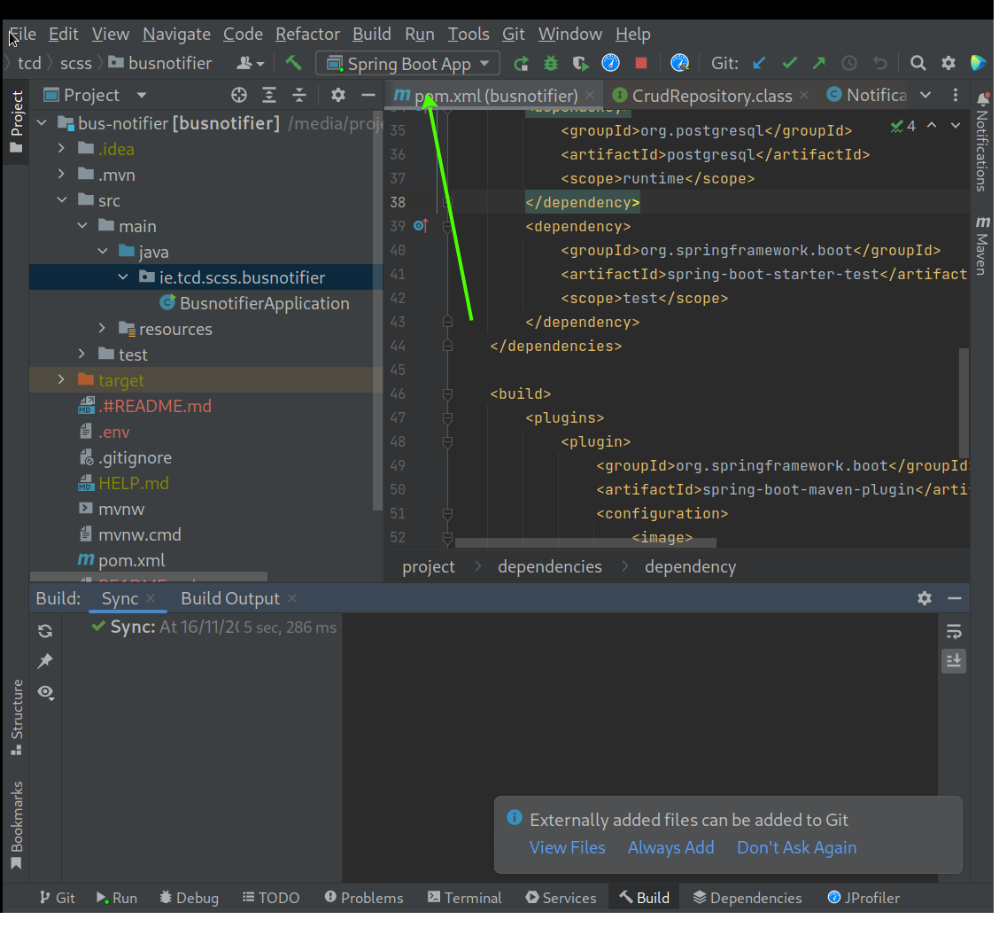
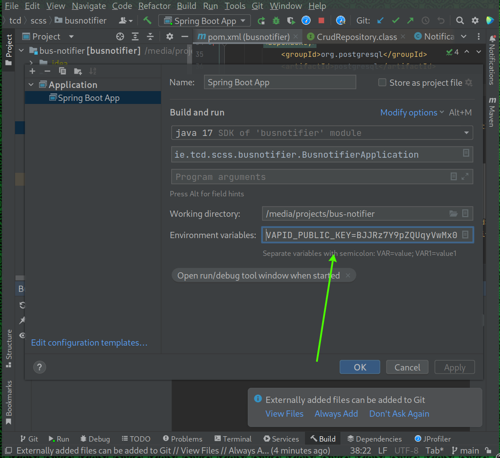
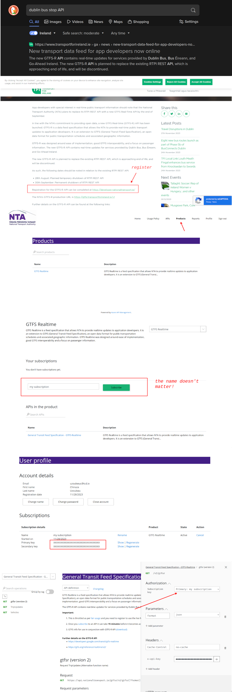

# Bus Notifier Project

A tool for receiving notifications when your bus is due to arrive soon.

## Setup

VAPID keys for testing purposes are provided in the `.env` file
included in the repository.  If using intellij, add these to your run
configuration:




There are many ways to create fresh VAPID keys, such as via:

- [web-push](https://www.npmjs.com/package/web-push) and
- [webpush-java](https://github.com/web-push-libs/webpush-java).

Similarly, a JWT signing key is provided for testing. A new key can be
generated as follows:

```bash
head -c 256 /dev/random | hexdump -v -e '/1 "%02X"'
```
# Running Postgres

You can either run an instance of postgres locally and manage
databases with pgAdmin, or you can use the docker configuration as
follows:

```bash
docker compose up postgres
```

## General Transport Feed Specification (GTFS) related set up

First of all you need to download the static GTFS-R data. I have made
the data accessible at a google drive link
[here](https://drive.google.com/file/d/1DBTmJlNgJlj-NjUgi6mk_ncmfDuWwWWi/view?usp=sharing). You
will have to extract that to a folder called `transposed` in the root
of the project. You must then set the `GTFS_DIR` environment variable
to the location of that folder.

Note that the publicly available GTFS data accesible from the
Transport For Ireland (TFI) website will not work as it is not for
GTFS-R, the realtime variety of GTFS.

The next thing you need to be aware of is that my API key is currently
used for getting live updates from the GTFS-R API of the National
Transport Authoriy. If you would like to obtain your own api key, a
series of images is presented below showcasing the basic outline of
how you might do that.



The data in the zip file I provide has had the columns rearranged to
be in alphabetical order as this is the order that spring boot (via
hibernate) arranges entity fields by default. Having the order of
fields in the table equivalent to the order of fields in the csv file
is important as it allows us to use postgresql's csv-import
capabilities without ever having the data touching the JVM and
creating garbage. *If you use this zip file, you do not need to
transpose the data manually*.

If you download a newer version from the GTFS-R webpage on the NTA
website, execute the following:

```
bash transpose.sh "<folder where you extracted the gtfsr .txt files>"
```
